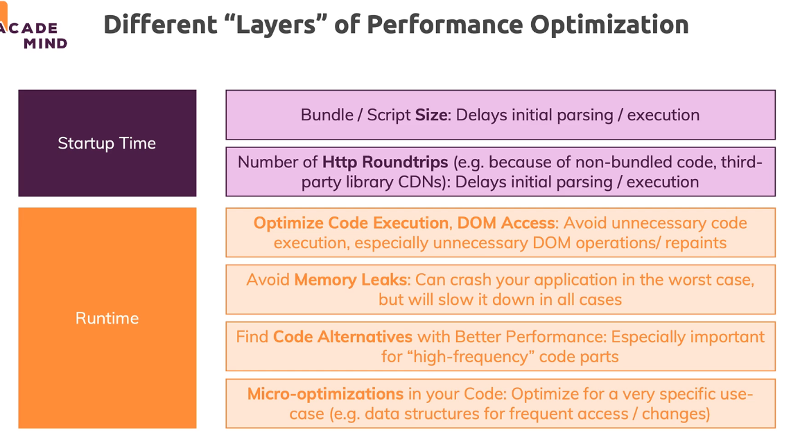

# Performance Optimization in JavaScript

- `Performance` is influenced by a lot of factors: CSS, HTML, JavaScript Code, server speed, server configuration
- `Startup Time`
  - how long does it take to see something on the screen
  - how quickly is a user able to interact with the page
- `Runtime Performance`
  - how smooth does app run (freezes, lag)
  - how smooth do animations play (visual lag)
  - are there any memory leaks (do you clean things that you do NOT need anymore), is page getting slower over time

## Recommendations

- `Startup Performance`

  - eliminate unnecessary or unused code, avoid using too many libraries
  - potentially add third-party libraries to bundle instead of via CDN
  - bundle code and use `lazy loading`
  - minify code

- `Runtime Performance`
  - avoid unnecessary code executions, batch operations together
  - find + fix memory leaks, even small ones
  - for high-frequency operations: use optimal JavaScript approach (re-validate regulary)
  - consider micro-optimization

## Different Layers of Performance Optimization



## Measuring and Auditing

- article about optimization of JavaScript execution: <https://web.dev/optimize-javascript-execution>

- measure only `production` code
- check roundtrips and script size and set script/bundle size budgets
- measure performance with devtools
- explore best practices, patterns and benchmarks

## Tools

- `performance.now()` or `performance.measure()`: add this to your code (during development/testing) and check execution time (difference) for certain operations

- `Browser DevTools` (all examples are based on `Chrome`): use the many features of browser dev tools to detect unnecessary code executions, HTTP requests and measure execution time and memory leaks

  - `Network` Tab

    - a) activate `Disable cache` (disabled as long as DevTools are open)
    - b) change `Online` to `Slow 3G` to simulate slower internet connection
    - c) check how much of your JS code is used: press `Esc` -> go to icon with 3 points -> open `Coverage`

      ```JavaScript
      // You could lazy load first unused code (look a modules in basics-concepts file)
      const foo = async () => {
        const { YOUR_NAMED_IMPORT_FUNCTION } = await import('./RELATIVE_PATH_TO_FILE.js')
        YOUR_NAMED_IMPORT_FUNCTION();
      }
      ```

  - `Performance` Tab

    - you can a) throttle your CPU, b) activate `Screenshots` and click on record button to record your interactions with page and see summary

  - `Memory`Tab

    - click on `take snapshot` button, do interact with page, take second snapshot and chose `Comparison` inside `Summary` dropdown

  - `Audits` tab
    - browser does checks for you

- `webpagetest.com`: test your entire (live) web page to detect optimization potential

## Micro-Optimizations

- only optimize what matters in the context of your app and the potential number of users, requests etc.
- if some techniques or methods in JavaScript are a little bit faster or slower does NOT matter in normal apps

## Server-side Optimizations

- 3 main areas of improvement which you might want to look into:

## Compression of served assets

Compression is about zipping static assets (CSS, JS, images) before serving them. Modern browsers know how to unzip such files and will automatically do so. Since zipped assets are transferred, less data is sent from server to client => Faster load time.

How you set up compression depends on which server/ service you're using. For example on Firebase, static assets are automatically compressed.

When having your own NodeJS server-side code, you would have to manually ensure that static assets are compressed (<https://github.com/expressjs/compression>).

## Caching (client-side and server-side)

Caching is a complex topic - it's about saving data or files for re-use and it can be done on different levels.

For example, browser automatically cache files (e.g. JS files) for you - based on the caching headers set by the serving host (<https://developer.mozilla.org/en-US/docs/Web/HTTP/Headers/Cache-Control>). So controlling these headers on the server-side config, allows you to control how browsers will cache such files. This can help you avoid unnecessary data transfer but of course you also have to make sure that visitors of your site don't miss out on important updates.

Server-side caching is all about storing data you work with on the server (e.g. fetched from a database) such that multiple requests requesting the same data can get that cached data.

You can learn more about caching here: <https://developers.google.com/web/fundamentals/performance/optimizing-content-efficiency/http-caching>

And here: <https://wp-rocket.me/blog/different-types-of-caching>

## HTTP/2

HTTP/2 is the latest "form" of the Http protocol and unlike HTTP 1, it allows for "server push". That means that servers can push required assets/ files actively to a client (instead of waiting for the client to request them).

You can learn more about it here: <https://developers.google.com/web/fundamentals/performance/http2>
